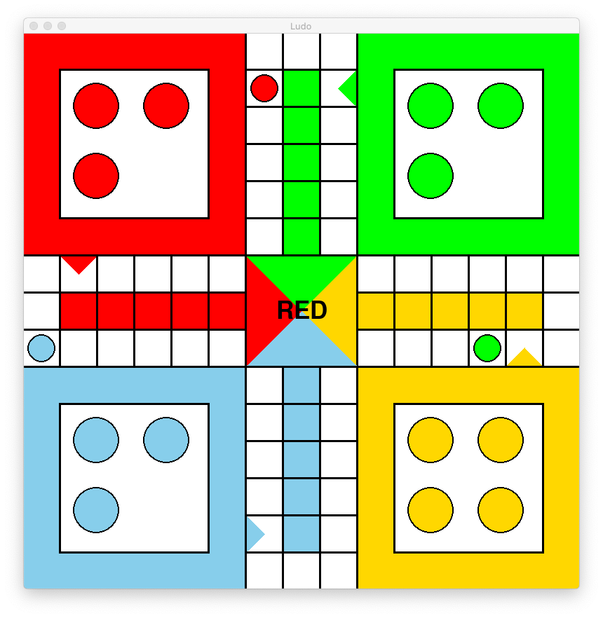

# Ludo
A pygame version of Ludo.



To setup:
```
virtualenv -p python3 .venv
source .venv/bin/activate
pip install -r requirmements.txt
```

To run:
```
python ludo.py

# Help
python ludo.py -h

# Run in demo mode where the computer just plays itself
python ludo.py -demo
```

## Features
- Play with a different number of players
- Roll a 6 to move piece out
- Knock other players pieces off the board if you land on them
- Roll again if you get a 6
- Must roll exact number to get home
- Demo mode where the computer plays itself

## Bugs
- There is currently no end game process, so the game will crash once a player has all their pieces home and roll a 6 to bring out a new piece that they don't have

## Improvements
- Implement the Colour class to clean up the use of colours all over the place
- Display the pieces that are home in the centre box
- Allow users to bring out multiple pieces at once
- Add in more "graphics" to show that colours move up to the home row
- Ability for users to choose how many players (code currently works for different numbers of players, but user cant select)
- Add in an end game state
- Use better colours that dont clash with each other as much
- Show something when a piece is knocked off the board
- Add tests
- Run through flake8
